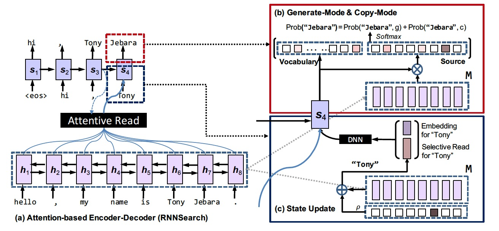
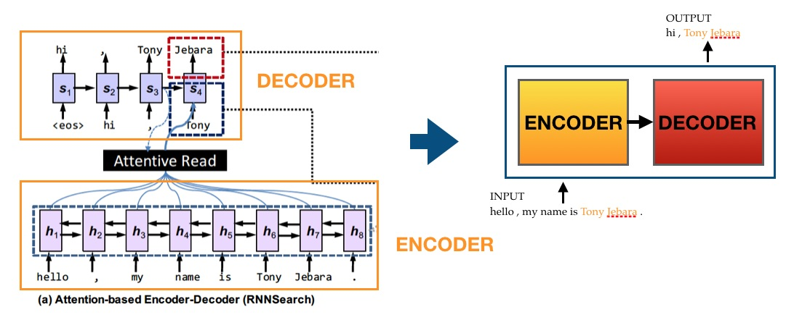
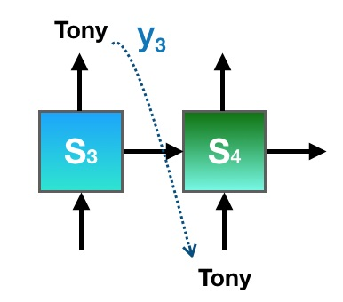
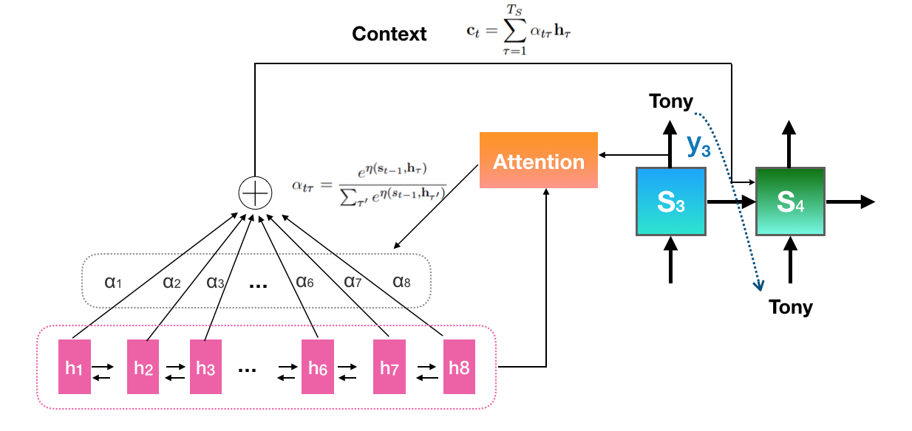
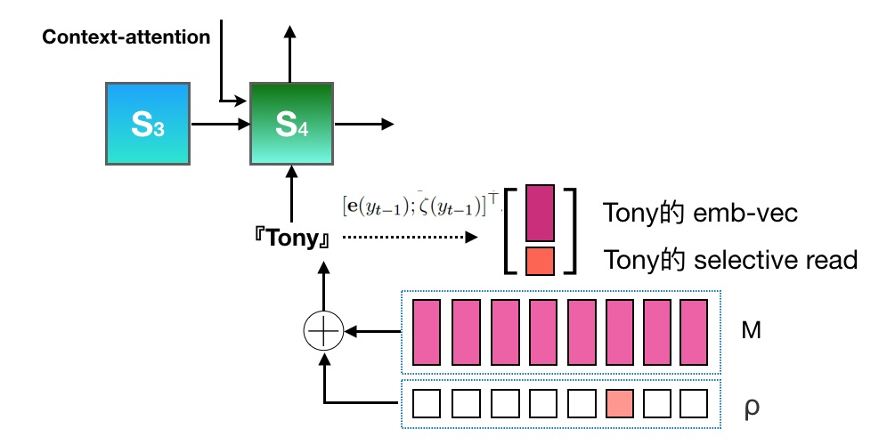
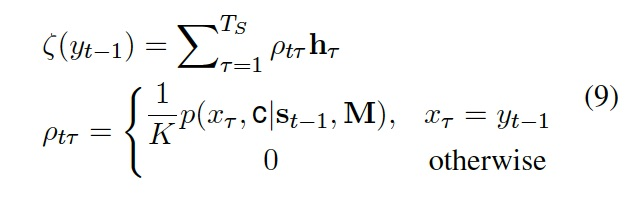
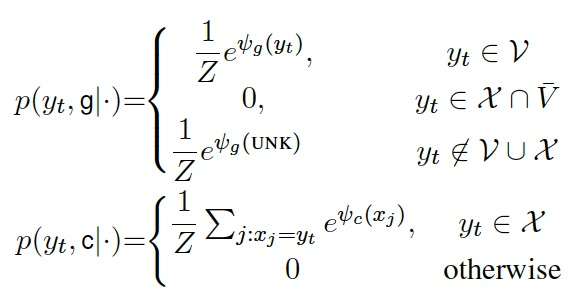
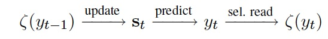

最近由于业务需求调研了 copynet，所以就准备以此作为博客的开篇啦，希望可以坚持下去~  
在这里参考的 paper 是16年的《Incorporating Copying Mechanism in Sequence-to-Sequence Learning》，

附上链接：[Incorporating Copying Mechanism in Sequence-to-Sequence Learning](https://arxiv.org/pdf/1603.06393.pdf)

在我看来copynet和 attention 机制的思想十分类似，所以如果有attention的背景应该能更好的理解（当然，这篇文章中其实也用了attention），下文中如有错误纰漏望不吝赐教~  
在这里先给出来关于 attention 的佳作，可能哪次有时间了也会总结一下吧~

链接：  [Attention Is All You Need] (https://arxiv.org/pdf/1706.03762.pdf)

## 引子
看看论文中给出的一个例子，这是一个对话系统，当你说出Tony Jebara这个名字的时候，回答中也会大概率重复这个名字，这不就很类似一种 copy 的思想吗~那么思想有了，应该怎么把它变成一种数学表达，应用到模型中去呢？ 

## 结构图

乍一眼看这个图可能会头昏，但是我们可以一步步的来拆解，先看懂每个模块是在干什么，然后再有针对性的去看公式。
上面这个图可以分成左侧和右侧两个部分，左侧是一个对话模型，其实也是传统的翻译模型，由encoder和decoder两个模块构成，可以简化成下图：

其中，encoder 部分是一个双向的 lstm，每一个时间步对应一个输入，图上是意会（直接输入每一个字），实际上一般是会先对字（词）进行onehot编码，然后去look up embedding，输入的是embedding size大小的向量。  
那么，如图所示，$$h_t$$ 对应的是每个时间步的encoder输出，你可以理解它们代表了输入的一些高维度特征（隐状态）。对这些$$h_t$$进行变化后将结果送给decoder解码，一般来说送的是最后一个时间步的输出（比如对应`tf.nn.bidirectional_dynamic_rnn`的话就是返回的`final_state`)。  
解码部分为了便于理解，我们针对上图中 $$t=4$$ 这一个时刻来分析。首先，对于传统rnn（不考虑attention），$$s_t=f(y_{t−1}, s_{t−1})$$  

 
加上 attention了以后，$$s_t = f(y_{t−1}, s_{t−1}, c_t)$$，其中 $$c_t$$ 是一个动态变长的context，具体可以看下图。那么我们可以很容易的看到，应用了attention机制以后，可以考虑encoder的每一个时刻的输出对s4状态的影响。  
  
那么，copynet又是要改变哪些部分呢，接下来我们进一步的来分析这篇论文的结构框图。可以发现，encoder部分并不需要多做改变，升级的点都是针对的decoder模块，主要有两个部分，分别是状态的更新以及最后的映射。

### A.状态更新
  
根据上面的描述，我们知道了 $$s_t = f(y_{t−1}, s_{t−1}, c_t)$$ 是受到三个输入的作用的，传统做法中$$y_{t−1}$$一般使用的是上一个时刻输出的字（词）对应的 emb-vec。copynet 中首先对这个部分进行了调整，在 emb-vec 的后面 concat 了一个称为"selective read"的向量 $$\zeta(y_{t−1})$$ ，如上图所示。  
  
从表达式中可以看到，$$t-1$$时刻的 $$\zeta(y_{t−1})$$ 也是由一组系数 $$\rho_{t\tau}$$ 和 $$h_{\tau}$$（对应的是每个时间步的encoder 输出）作用得到的，看起来和 attention 几乎一样，区别在于$$\rho$$的计算：只有当上一个时刻的输出在 source 中出现的时候，对应的系数才有值。比如 $$t=4$$ 的时候，上一个时刻输出的是 Tony，Tony这个词对应source 中 $$t=6$$ 的输入，那么 $$\rho_{46}$$ 就不为0。通过这种方式，便可以把输入中 Tony的信息作用到 decoder 中，那么 $$s_4$$ 拿到的就不仅仅是 Tony 的 emb 信息，还有输入端 tony 的位置信息以及上下文信息。  

### B.预估模块的调整—增加copy 模式  
传统做法中，rnn的输出会先通过线性变化映射成 vocab-size 大小的向量，然后通过$$argmax（softmax（$$$${\textbf{o}_t})）$$来得到当前时刻的输出。在这里，作者将这种输出模式称之为Generate-Mode，并引入了另一种Copy-Mode的形式作为补充。那么这么做的好处是什么呢？  
首先简单提一个概念：OOV（Out-of-vocabulary），意思是假设有一个的数据集，这个数据集中有一些词并不在现有的vocabulary里，我们就说这些词汇是Out-of-vocabulary，简称OOV。比如在文本生成问题中经常会生成一些字/词，由于它们并没有在我们事先加载好的词表里，所以就被映射成了 UNK，从而导致生成的句子效果不佳。
引入了 copy-mode 则可以较好的解决这个问题，做法相当于是对原始的词表进行了扩充，如下图。  
  
从图上可以看到，深紫色部分代表的是事先加载好的词表，传统做法是不属于其中的字/词都当做 UNK 处理。在本篇文章中，作者将训练样本中的 source 部分切字/词构成了 X 集合，由此便出现了上图的浅紫色圆圈。每个部分都对应有分数（score）的计算方式，整个合在一起进行归一化。  
举个栗子：  
假设 Tony 这个词出现在两个字典的交集部分，那么它的score就不只是传统的Generate-mode 计算方式，同时还要计算Copy-Mode对应的 score，那么相比别的只出现在 V 集合中的词，它的可能性会更大。  
再比如Jebara这个词，如果 V 中没有包含这个生僻的单词，那么传统做法下它会被映射成 UNK，但是有了Copy-Mode，由于它在 source 中出现过，那么它会按照浅紫色部分获得 score，从而被copy出来。
具体的计算公式如下：  
  
然后再经过$$argmax（softmax（$$$${\textbf{o}_t})）$$来得到预估的输出。  

### 小结
通过上述的讲解我们发现，copynet 类似于 attention，也对 encoder 输出的隐状态$$M（{h_1, ..., h_{T_S}}）$$分配了系数作用到 decoder 部分。那么可以理解成 copynet 采用了一种混合机制来获取 M 中的信息，可以分为content-base和location-base 两个角度来对信息编码。   
Content-base主要是 attention 在主导，这里不作过多的说明。    
Location-based Addressing:    
由于encoder 输出的隐状态中包含了位置信息，对于 X 集合中出现的字/词来说信息流动便可以简单的看做一种『右移』操作。    
  
比如，Tony 对应的selective read信息集中在 source 的第 $$l$$ 个位置处，随之更新的状态 $$s_4$$在预测$$ y_4$$的输出时就会更倾向于copy-mode 下的 source 中 $$l+1$$处的字，即Jebera。  

至此，copynet 这篇文章的主要内容就介绍完了，其实只要读懂了作者思想的来龙去脉，公式和代码都是辅助理解的工具罢了。

